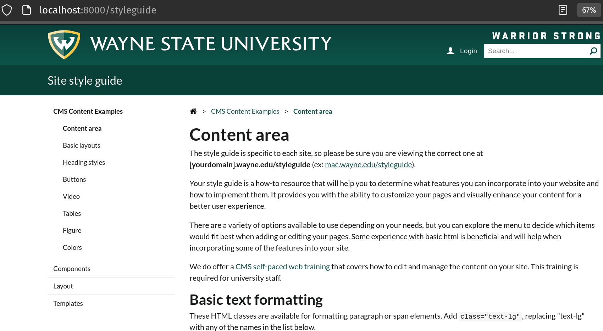
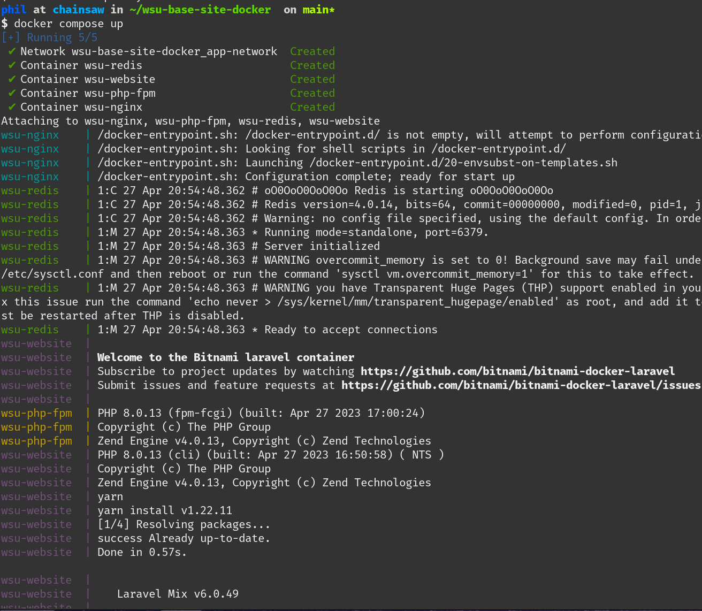
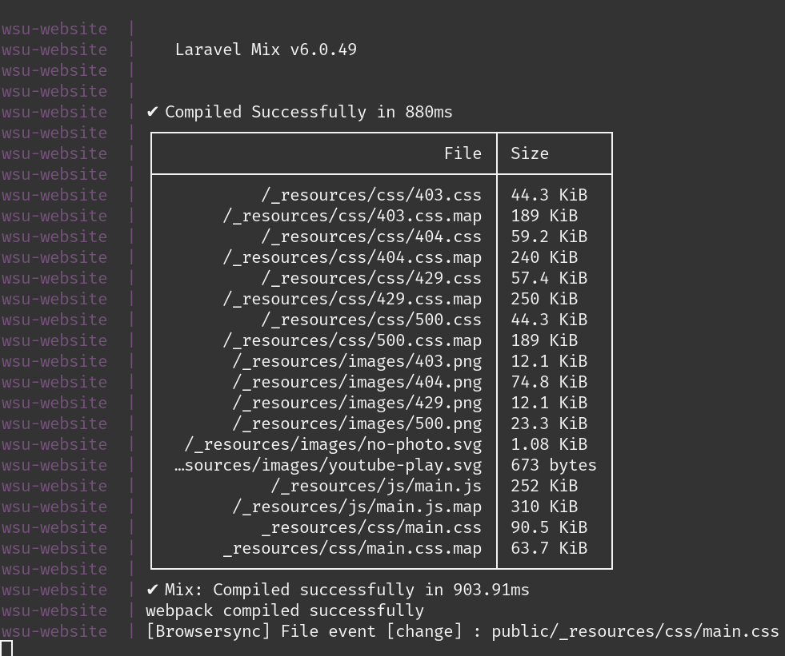
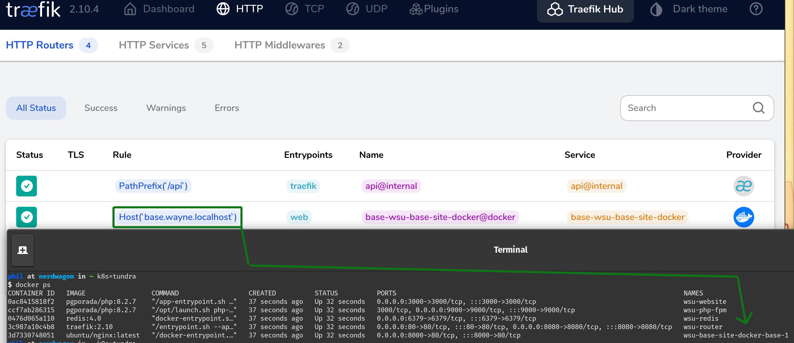

# Overview





# Usage
Pull down the Wayne State University `base-site` repository inside of _this_ repository i.e.
```
git clone https://github.com/pgporada/wsu-base-site-docker
cd wsu-base-site-docker

git clone https://github.com/waynestate/base-site
cp base-site/.env.example base-site/.env
sed -i.bak -E 's/^REDIS_HOST=localhost$/REDIS_HOST=wsu-redis/' base-site/.env

# Have a recent version of Golang to install minica which we'll use to generate a wildcard TLS certificate
# On OSX you can probably just: `brew install go`
go install github.com/jsha/minica@latest

# This will output key material into ./.certs
./gen-cert.sh
```

Run the containers or shut them down
```
docker compose up
docker compose down
```

Now, do development work locally on your machine and watch as the changes are reflected in the docker container and via the `make watch` command.

To view running container information:
```
docker ps
```

To access a container, keep in mine that ports are mapped `LOCAL:REMOTE` meaning that `0.0.0.0:32678:3000` means you can access `localhost:32678` in a web browser and traffic destined for there will be sent to port 3000/tcp inside the container.


# Understanding Routing and Accessing My Website



The gist of how Traefik is performing routing for this project is:
```
[you] ---start docker-compose--->
  [traefik] --->detect docker-compose service names and dynamically generate routes--->
    [you] ---web request on port 80 for base.local--->
      [traefik] ---route your request to the container with service name "base" -->
        [nginx] --->reverse proxy over to php-fpm --->
          [php-fpm] --->render the php and return it back up the stack to you, the client
            [you] --> Happy again, probably
```

What this looks like in the `docker-compose.yml` file is the following. Each service name is located on the 1st indentation level, in this case it would be `base` and `traefik`. It's important to note here that we're calling nginx "base" because nginx is also performing routing/reverse proxying over to the actual php content we care about. The routes are dynamically being added by traefik because of a `defaultRule` which uses some crazy complex Go templating exposed by Docker.
```
service:
  base:
    image: ubuntu/nginx:latest
    labels:
      - "traefik.enable=true"

  traefik:
    command:
      - "--api.insecure=true"
      - "--entrypoints.web.address=:80"
      - "--providers.docker=true"
      - "--providers.docker.exposedbydefault=false"
      - '--providers.docker.defaultRule=Host(`{{ index .Labels "com.docker.compose.service" }}.wayne.localhost`)'
```

If instead you want an artisanally crafted bespoke set of routing rules, we can define them manually on each container as follows and name the routing rule whatever we wanted. This is probably what I would do in a staging or production environment rather than the magic defaultRule.
```
  nginx:
    labels:
      - "traefik.enable=true"
      - "traefik.http.routers.wsu-base.rule=Host(`base.wayne.localhost`)"
      - "traefik.http.services.wsu-base.loadbalancer.server.port=80"
```

We're using Nginx to reverse proxy all traffic intended for `.php` files to a specific php-fpm container. Nginx needs to do this because it does not have a FastCGI handler built in, unlike Apache, which does.

## Why domain.localhost?
[Base](https://github.com/waynestate/base-site) has references to `.wayne.local`. The `.local` suffix is specifically intended for mDNS per [RFC 6762](https://datatracker.ietf.org/doc/html/rfc6762#section-3) which means that base is _doing the wrong thing (TM)_. Instead `.local` was changed to `.localhost` which **always** resolve to the loopback address (typically 127.0.0.1 or ::1) depending on IPv4/IPv6 per [RFC 6761](https://www.rfc-editor.org/rfc/rfc6761.html#section-6.3).


# Building a new container
The first time you run the build, PHP and PHP-FPM will be compiled based on the version of PHP stored in `./base-site/.phpbrewrc` which can take upwards of 20 minutes on a `11th Gen Intel(R) Core(TM) i7-1165G7 @ 2.80GHz`. Subsequent runs of build will take seconds because of how container layer caching works.
```
./build.sh

docker tag wsu-base-container pgporada/php:8.0.13
docker push pgporada/php:8.0.13
```

# Additional reading
1. https://gist.github.com/soifou/404b4403b370b6203e6d145ba9846fcc
1. https://github.com/nickdenardis/docker-php
1. https://blog.joshwalsh.me/docker-nginx-php-fpm/
1. https://aschmelyun.com/blog/fixing-permissions-issues-with-docker-compose-and-php/
1. https://www.digitalocean.com/community/tutorials/how-to-set-up-laravel-nginx-and-mysql-with-docker-compose-on-ubuntu-20-04
1. [Setting up Traefik with dnsmasq or NetworkManager](https://www.adaltas.com/en/2022/11/17/traefik-docker-dnsmasq/)
