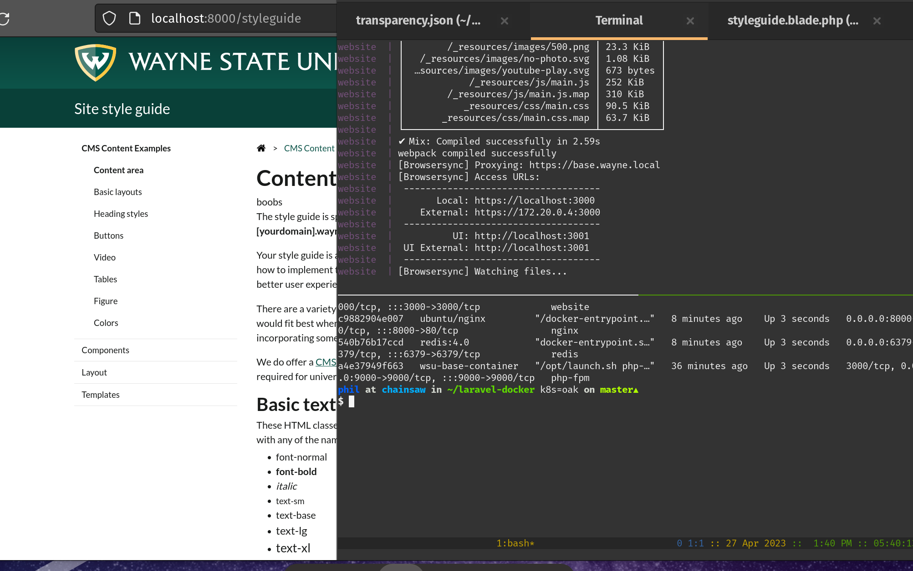

# Overview



# How to use this stuff
Pull down the Wayne State University `base-site` repository inside of _this_ repository i.e.
```
git clone https://github.com/pgporada/wsu-base-site-docker
cd wsu-base-site-docker
git clone https://github.com/waynestate/base-site
```

Build the containers you need to do the job.
```
./build.sh
```

Run the containers or shut them down
```
docker compose up
docker compose down
```

Now, do development work locally on your machine and watch as the changes are reflected in the docker container and via the `make watch` command.

To view running container information:
```
docker ps
```

To see what containers are downloaded on your machine:
```
docker images
```

To access a container, keep in mine that ports are mapped `LOCAL:REMOTE` meaning that `0.0.0.0:32678:3000` means you can access `localhost:32678` in a web browser and traffic destined for there will be sent to port 3000/tcp inside the container.


# Additional reading
https://gist.github.com/soifou/404b4403b370b6203e6d145ba9846fcc

https://github.com/nickdenardis/docker-php

https://blog.joshwalsh.me/docker-nginx-php-fpm/

https://aschmelyun.com/blog/fixing-permissions-issues-with-docker-compose-and-php/

https://www.digitalocean.com/community/tutorials/how-to-set-up-laravel-nginx-and-mysql-with-docker-compose-on-ubuntu-20-04
